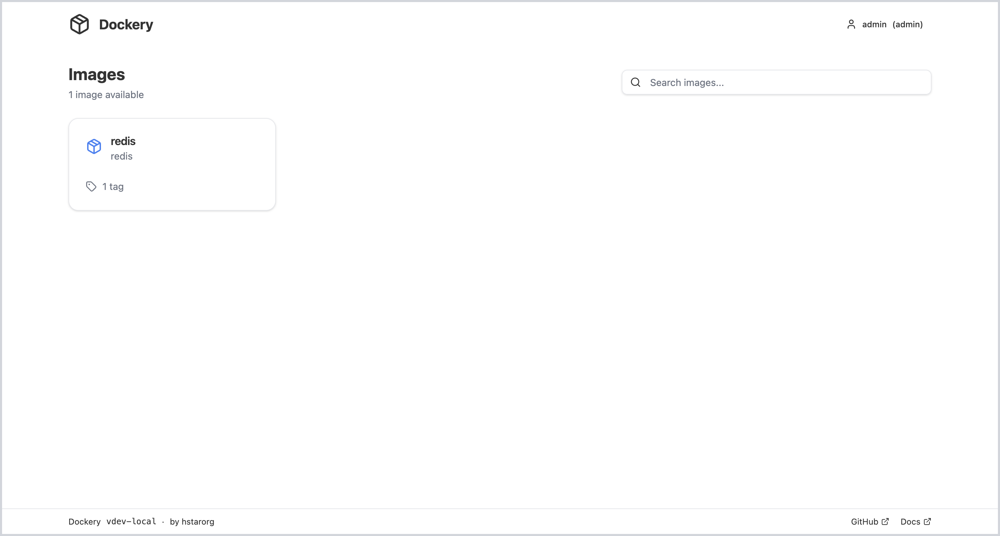
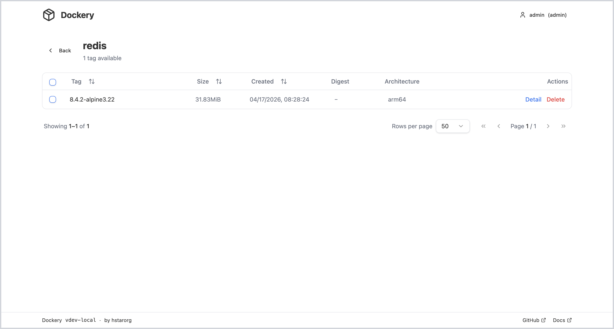
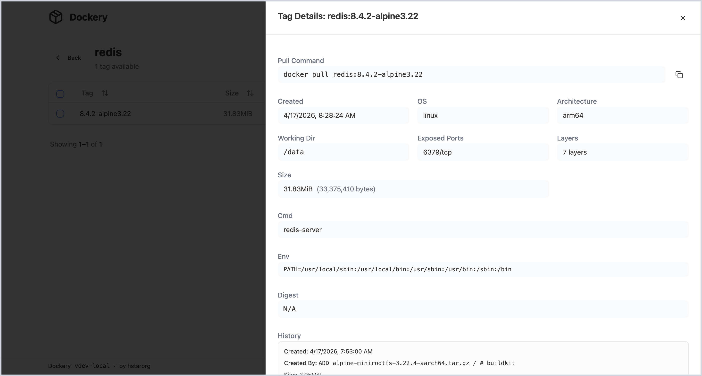
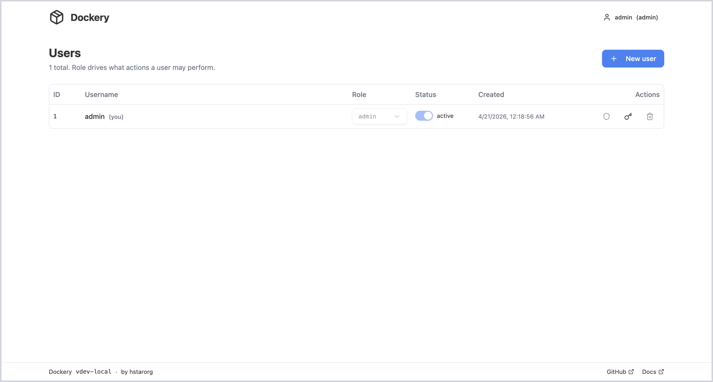
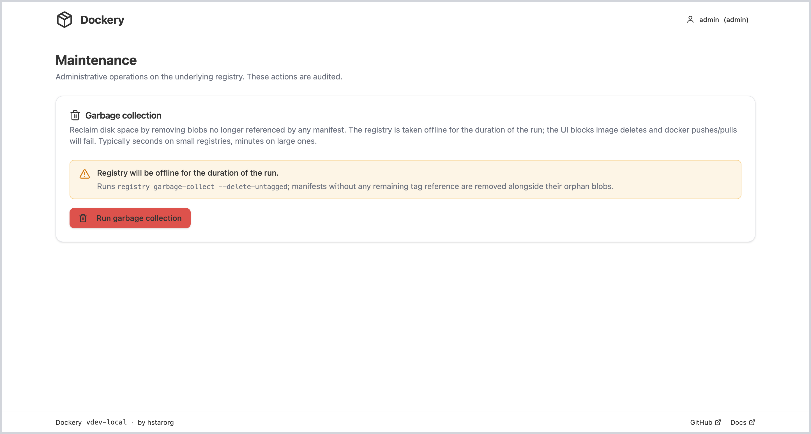
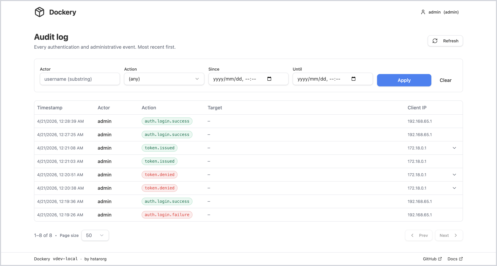
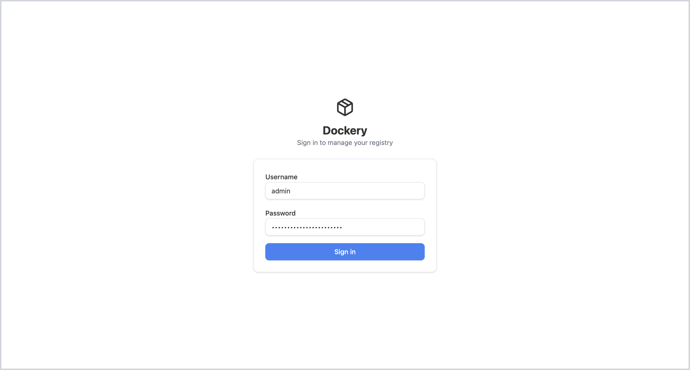

# Dockery

Self-hosted Docker Registry — **Distribution v3.1.0 + React UI + accounts/permissions + single image**. One container runs the registry, API, and Web UI behind one nginx port. For small teams and individuals who don't want Harbor.

[中文](./README.md) · [Deployment guide (CN)](./docs/deployment.md) · [Design doc (CN)](./docs/dockery-design.md) · [Changelog](./CHANGELOG.md)

## Features

- 📦 Push / pull / browse OCI + Docker v2 images
- 🔐 CLI + Web UI share one user store; three roles (`admin` / `write` / `view`) with per-user glob repo patterns
- 🔑 Ed25519-signed short-lived registry JWTs (5 min default, verified by registry via JWKS)
- 🌐 React 19 UI: login, route guards, user & permission management, password change
- 🐳 Single image, single port, SQLite + filesystem blob storage; back up `/data`

**Out of scope for v0.1:** image scanning, cosign signing, replication, multi-tenancy, HA, pull-through cache.

## Screenshots

<table>
<tr>
<td colspan="2" valign="top" align="center"><br/><sub>Catalog — all repositories at a glance, with search</sub></td>
</tr>
<tr>
<td width="50%" valign="top"><br/><sub>Tag list — sort, bulk multi-select, multi-arch badge, pagination</sub></td>
<td width="50%" valign="top"><br/><sub>Tag detail drawer — pull command, config, layer history, per-arch digests</sub></td>
</tr>
<tr>
<td valign="top"><br/><sub>Users — roles, enable/disable, per-user repo glob patterns</sub></td>
<td valign="top"><br/><sub>Maintenance — trigger garbage collection to reclaim orphan blobs</sub></td>
</tr>
<tr>
<td valign="top"><br/><sub>Audit log — login / token / admin events, filterable by actor / action / time</sub></td>
<td valign="top"><br/><sub>Login</sub></td>
</tr>
</table>

## Quick start

```bash
# Docker Desktop → Settings → Docker Engine: "insecure-registries": ["localhost:5001"]
DOCKERY_ADMIN_PASSWORD='change-me' docker compose up --build -d
open http://localhost:5001      # log in as admin / change-me
```

`DOCKERY_ADMIN_PASSWORD` only takes effect on first boot against an empty `/data`. Add your own reverse proxy for TLS (M4 will bundle it).

### Push an image

```bash
docker login localhost:5001
docker tag hello-world localhost:5001/demo/hello:1
docker push localhost:5001/demo/hello:1
```

## Run in production

Pull the prebuilt image — [`ghcr.io/bizjs/dockery`](https://github.com/bizjs/Dockery/pkgs/container/dockery) — instead of building from source. Pin a concrete version tag; rolling `:latest` can surprise you. Put TLS in front (nginx / Caddy / Traefik); until then, docker clients need `localhost:5001` (or your host) in `insecure-registries`.

### Option A — `docker run`

```bash
docker run -d \
  --name dockery \
  --restart unless-stopped \
  -p 5001:5000 \
  -v /srv/dockery:/data \
  -e DOCKERY_ADMIN_PASSWORD='change-me-on-first-boot' \
  -e REGISTRY_AUTH_TOKEN_REALM='https://registry.example.com/token' \
  ghcr.io/bizjs/dockery:0.1.0
```

`-v /srv/dockery:/data` bind-mounts a host directory — recommended in production for easy backup. A named volume (`-v dockery-data:/data`) is fine for a quick try. See [Storage](#storage--data-common).

### Option B — `docker compose`

Use [`docker-compose.ghcr.yml`](./docker-compose.ghcr.yml) from this repo:

```bash
export DOCKERY_ADMIN_PASSWORD='change-me-on-first-boot'
export REGISTRY_AUTH_TOKEN_REALM='https://registry.example.com/token'
export DOCKERY_IMAGE='ghcr.io/bizjs/dockery:0.1.0'   # pin a version

docker compose -f docker-compose.ghcr.yml pull
docker compose -f docker-compose.ghcr.yml up -d
```

First boot seeds the admin account; subsequent boots ignore `DOCKERY_ADMIN_PASSWORD` (change it via the UI or `dockery-api user passwd`).

## User & permission management

**Web UI (admin menu → Manage users)** — create users, edit role, reset password, enable/disable, delete, and manage per-user repo patterns in a drawer for `write` / `view` accounts. Users with the `view` role don't see the tag-delete button. Everyone can self-service password change via the avatar menu.

**CLI fallback** (no HTTP server required):

```bash
docker exec -it dockery dockery-api -conf /etc/dockery user list
docker exec -it dockery dockery-api -conf /etc/dockery user create alice write
docker exec -it dockery dockery-api -conf /etc/dockery user grant  alice 'alice/*,shared/app'
docker exec -it dockery dockery-api -conf /etc/dockery user passwd alice
docker exec -it dockery dockery-api -conf /etc/dockery user revoke 42       # permission id
docker exec -it dockery dockery-api -conf /etc/dockery user delete alice
```

Deleting or demoting the last admin is refused.

## Configuration

### Environment

Grouped by tier: **required** to boot, **common** to set in production, and **other** advanced passthroughs.

**Required**

| Variable | Notes |
|---|---|
| `DOCKERY_ADMIN_PASSWORD` | First-boot admin password. Required while `/data` is empty; ignored after the first admin exists. Unset + empty DB → api fatals intentionally (no random password generated, avoids leaking via logs). |

**Common** (production)

| Variable | Default | Notes |
|---|---|---|
| `REGISTRY_AUTH_TOKEN_REALM` | `http://localhost:5001/token` | URL distribution advertises to the docker CLI in `WWW-Authenticate`. **Must be reachable from the CLI** — e.g. `https://registry.example.com/token`. Wrong value → `docker push` 401s. |
| `DOCKERY_ADMIN_USERNAME` | `admin` | First-boot admin username. Only used when the users table is empty. |
| `DOCKERY_IMAGE` *(compose only)* | `ghcr.io/bizjs/dockery:latest` | Pin a concrete tag, e.g. `ghcr.io/bizjs/dockery:0.1.0`. |

**Other** (advanced)

| Variable | Notes |
|---|---|
| `REGISTRY_STORAGE_*` | Forwarded verbatim to distribution. Switch blob backend to S3 / OSS / Azure, etc. See [distribution configuration](https://distribution.github.io/distribution/about/configuration/). |
| Any other `REGISTRY_*` | `REGISTRY_<SECTION>_<FIELD>` is consumed by distribution (log level, HTTP headers, etc.). |

Token TTL, issuer, session cookies etc. live in `docker/rootfs/etc/dockery/config.yaml` (baked into the image). To customize, mount your own over `/etc/dockery/`.

### Storage — `/data` (common)

All persistent state lives under a single container path, `/data`. In production, **bind-mount a host directory** onto it so backups and inspection are just filesystem operations:

```bash
-v /srv/dockery:/data      # docker run
```

```yaml
# docker-compose.*.yml — replace the named volume
volumes:
  - /srv/dockery:/data
```

Named Docker volumes (as in the quick-start examples) also work and are fine for single-host setups, but a host path is easier to back up, snapshot, and migrate.

Layout inside `/data`:

```
/data/
├── registry/          image blobs (filesystem driver, default)
├── db/dockery.db      SQLite (users / repo_permissions / audit_log)
└── config/
    ├── jwt-private.pem  Ed25519 private key (0600) — single source of truth
    └── jwt-jwks.json    JWKS derived from the private key on every boot
```

**Back up `/data` as a whole.** Lose `jwt-private.pem` → all issued tokens are void; lose `dockery.db` → user table reset.

> Switching blob storage to S3 / OSS / Azure via `REGISTRY_STORAGE_*` only moves `registry/`. `db/` and `config/` still need `/data` mounted.

## Architecture

```
           external :5001 (host → :5000 container)
                       │
                   [ nginx ]
    ┌────────────┬────────┬────────────┐
    │            │        │            │
   / static   /token   /api/*        /v2/*
    │            │        │            │
 web-ui    dockery-api :3001   distribution :5001
                 │                    ▲
                 ├── SQLite           │
                 ├── jwt-private.pem  │
                 └── jwt-jwks.json ───┘  registry verifies via JWKS
```

Three in-container processes managed by supervisord. Full design in [`docs/dockery-design.md`](./docs/dockery-design.md) (Chinese).

## Local development

```bash
# Frontend (:5173)
cd apps/web-ui && pnpm install && pnpm dev

# Backend (:5001)
cd apps/api && make run

# Bare registry (:5000) for the frontend's /v2 proxy
docker run -p 5000:5000 distribution/distribution:3.1.0
```

## Release

Push a `v*` tag → GitHub Actions builds and pushes `ghcr.io/<owner>/<repo>:<version>` and `:latest` (linux/amd64 + linux/arm64). One image, no `-ui` split.

## Acknowledgments

- [`distribution/distribution`](https://github.com/distribution/distribution) — the registry protocol implementation Dockery embeds.
- [`joxit/docker-registry-ui`](https://github.com/joxit/docker-registry-ui) — referenced for UX patterns while designing Dockery's catalog and tag views (layout, size formatting, manifest-detail flows). Dockery reimplements them from scratch in React 19 on top of its own auth-aware `/api/registry/*` endpoints.

## License

See [LICENSE](LICENSE). Contributions welcome — please open an issue or discussion first for larger changes.
